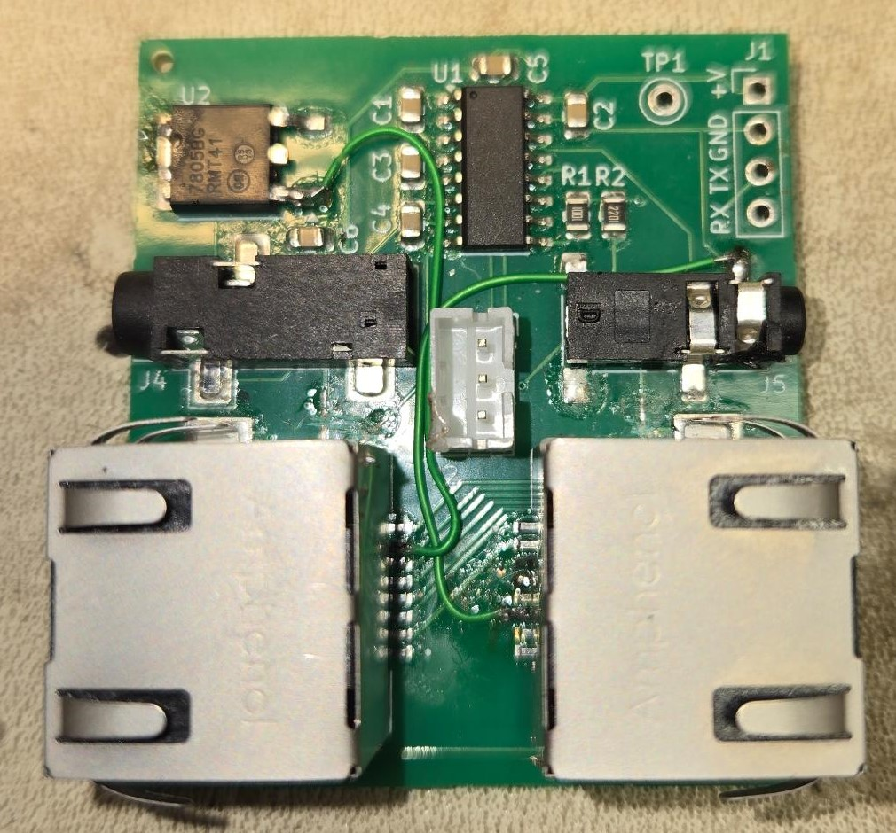

# **WARNING!!** 
This board requires modification to work with the D710 radios.

## Documentation for Version 1 of the GPS_BT-710 project

This is the schematic and PCB layout for how it comes to you. It has the following problem:

1. The Error in the version one design is that the pins on the physical ethernet jack were flipped from the pictured schematic. Therefore I did not pull GND and +10V off from the headunit connection. Please Jump down to [Modifications Needed](#required-modifications)

## Required Modifications

 Here are the modifications you have to make 

1. Cut 3 traces (Labled left to right)
    - +10V
    - GND
    - GND

2. Solder two wires to bring out 10 volts and GND to the rest of the board. (Shown in RED)

## Modiifed Board
