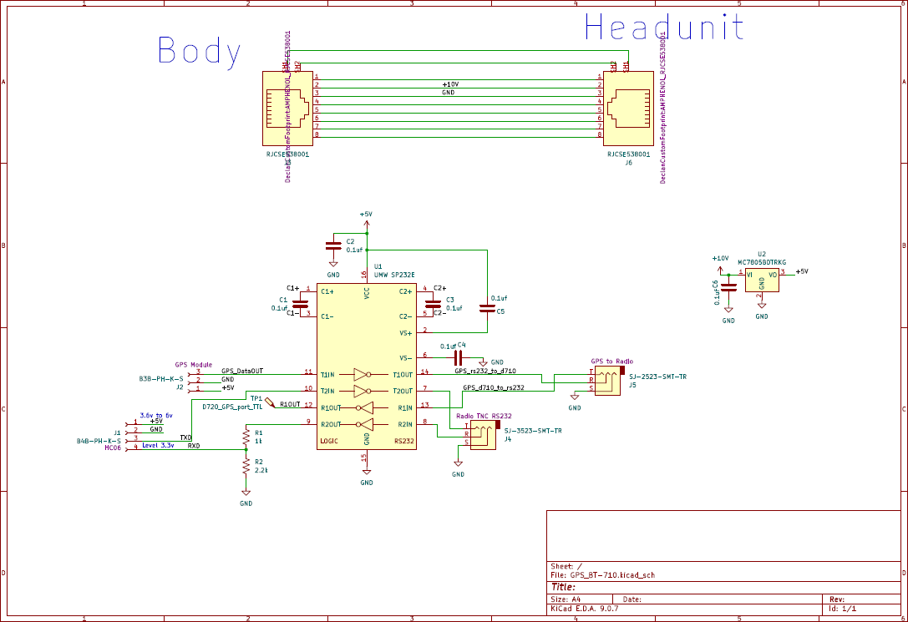
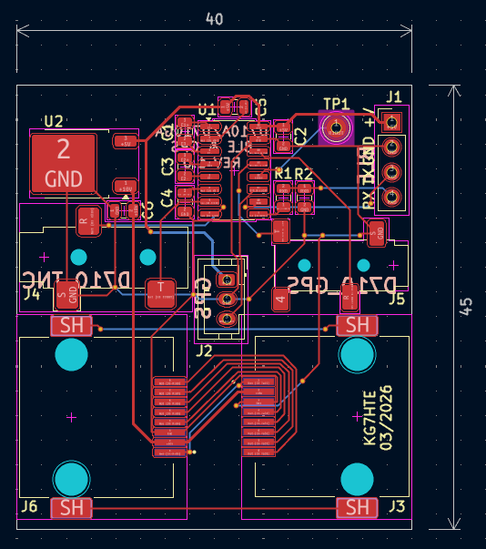
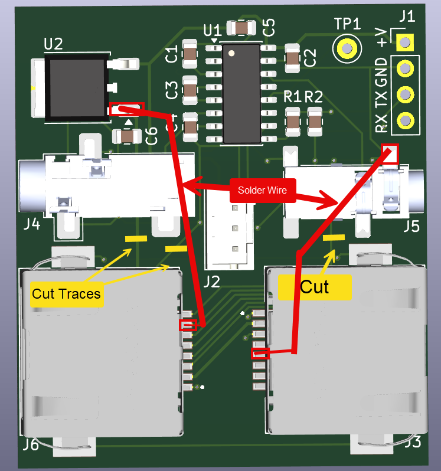

# Documentation for Version 1 of the GPS_BT-710 project

# Modifications to PCB to work with TMD7110

The Error in version one design is that the pins on the physical ethernet jack were flipped from the picture schematic and so my attempt to pull ground and 10 volts offf from the connection to the head unit failed. Here are the modifications you have to make 

1. Cut 3 traces (Labled left to right)
    - +10V
    - GND
    - GND

2. Solder two wires to bring out 10 volts and GND to the rest of the board. (Shown in RED)

